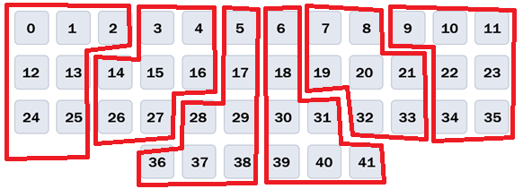

# MOKA CLI
USBシリアル経由で CLI による MOKA の詳細な操作機能、デバッグ機能にアクセスできます。
MOKA とは別の操作用キーボードもPCにつないでください。
現時点では、どうしても必要な場合にのみ使うことを想定しているので、網羅的な説明は書いていません。

使えるコマンドはヘルプで確認できますが、それだけだと正確な使い方が分からないコマンドもあるので、参考程度に見てください。
help <kbd>&#x23ce;</kbd> でコマンド一覧が確認できます。
help コマンド名 <kbd>&#x23ce;</kbd> で、そのコマンドの書式が確認できます。

## 0. MOKA をファクトリーモードで起動
* MOKA タクトスイッチ（左手側の左下ボタン）を押したまま、メインマイコンのリセットボタン（マイコン上の右側ボタン） をポチっと押して、タクトスイッチは押したまま 5秒ほど待つ。

* タクトスイッチを離すと、PC に MOKA が再認識され、同時に USBシリアルポートが認識される。シリアルポートの番号はデバイスマネージャ等で確認ください。

* VS CODE の Serial Monitor などシリアルポート接続ができるツールで該当ポートに接続してください。

* ファクトリーモードで起動した直後は、MOKA はエマージェンシーモードに入っており、磁気スイッチおよびタッチパッドの入力は受け付けません。

* MOKA を通常モードに戻すには、単にメインマイコンのリセットスイッチを押してください。

## 1. 磁気スイッチ毎のアクチュエーションポイント設定
> [!CAUTION]
> ここに記載する CLI でのアクチュエーションポイント設定は、キーマップエディタでの設定と競合します。
> 具体的には CLI でキー個別の値を設定したあとにキーマップエディタで設定を保存すると、全キーがキーマップエディタでのアクチュエーションポイント設定値で上書きされます。
> キーマップエディタで設定を保存した場合は、その後に改めて CLI でキー毎アクチュエーションポイントを設定しなおしてください。

> [!NOTE]
> キー毎アクチュエーションポイント設定をキーマップエディタで出来るようにするかどうかは今後考えます。
> 一度やってみたもののシンプルな画面構成にできず画面がごちゃごちゃになり、一旦やめました。

以下、全体の流れです。
1-1. 動作確認がしやすいよう、キーボードのモードをいくつか設定します。

1-2. ベースとするキーマップをロードします。

1-3. 次にキー毎のアクチュエーションポイントを設定します。

1-4. 設定を保存します。このときアクチュエーションポイントだけでなくキーマップなどすべてが同時にセーブされます。なので、1でベースとするキーマップをロードしておく必要があります。

以下、具体的な手順です。

### 1-1. キーボードモード設定
* PCへのキー情報送信の停止
```shell
hidrpt k
```
keyboard off, と出ればOKです。これでキーを押してもキー情報がPCには送信されないので、動作確認でキーを押しても PCでの余計な入力が発生しません。
もう一度 hidrpt k を実行するとキー情報の送信が on になります。
* エマージェンシーモードの解除
```shell
emergency 0
```
これでエマージェンシーモードを抜けて、磁気スイッチの入力を受け付けるようになります。

### 1-2. ベースキーマップのロード
```shell
keymap l 0
```
番号はベースとして使うプロファイル番号です。
上記の場合はプロファイル0 がキーボード上のアクティブな設定としてロードされます。
ロードされた状態を確認するには以下のコマンドを使います。
* keymap a
アクティブキーマップが表示されます。縦にキー番号、横にレイヤ0～3 が並びます。
* keymap a m
アクティブ磁気スイッチ設定が表示されます。アクチュエーションポイント情報もこれで確認できます。
* keymap a c
アクティブ共通設定が表示されます。LED設定等です。

### 1-3. アクチュエーションポイント設定
キー毎の設定の書式です。
```shell
keyattr k 0 60 150 30 50 900
```
各数字は、キーマップエディタでの設定名称でいうと、
keyattr k [キー番号] [半押し] [全押し] [半リリース] [全リリース] [タップ]
です。
>[!WARNING]
>キーマップエディタでの設定の並びとは少し違うので注意ください。

全キーを一括で設定する場合は 'k キー番号' を省略します。
```shell
keyattr 60 150 30 50 900
```

半押し、全押し、半リリース、全リリース　を個別に設定する場合の書式はそれぞれ以下です。
'k キー番号' を省略すると全キーの一括設定になります。
```shell
keyattr k 0 P 60
keyattr k 0 p 150
keyattr k 0 R 30
keyattr k 0 r 50
```

設定した結果の確認は以下。
```shell
keymap a m
```

実際にキーを押してみてLEDの状態から反応位置を確認してください。

### 1-4. 保存
>[!CAUTION]
>保存する前に、keymap a コマンドで本当に保存してよいキーマップかを確認してください。
>もし 1-2 でのベースキーマップのロードを忘れていると、全く想定していないキーマップが保存されてしまうかもしれません。

```shell
keymap s 0
```
s のあとの番号は保存したいプロファイル番号です。

正しく保存されたかを確認するには、keymap コマンドにプロファイル番号を指定して内容を表示させます。
```shell
keymap 0
keymap 0 m
keymap 0 c
```


## 2. 磁気スイッチのリリース状態・プレス状態確認
* MOKA には磁気スイッチをコントロールするサブマイコンが 6つ搭載されています。それぞれ赤枠のキーを担当していて、左側から 0～5 の番号が振られています。


* keyval 0 <kbd>&#x23ce;</kbd> でサブマイコン0 のキーの状態が表示されます。

表示される内容の意味は以下の通り。
* rawval：今現在の磁気センサー読み取り値の生数値

* rawrelease：磁気スイッチのリリース状態時のセンサー値（MOKA起動時に測定）

* rawpress：磁気スイッチの押し込み状態時のセンサー値（キャリブレーションで測定）

* val：磁気スイッチが押されている位置を 0～255 に変換した値

キーをリリースした状態なら val が 0付近、キーを押し込んだ状態なら val が 255付近、となるのが正常です。
