# MOKA 取扱説明

## 0. はじめに
本キーボードキットに含まれない以下のものをご自身で用意ください。
* **磁気スイッチ**：KS20互換のもの 42個
* **キーキャップ**：普通の 19mm サイズのもの。
* **PCと接続する USBケーブル**：キーボード側が USB-C形状のもの。通信規格は USB2.0 のもので大丈夫です。

また、本キーボードを組むには以下のものが必要になるので手元にあるか確認ください。
* **必要なもの**
  1. **プラスドライバー**：M2サイズのネジに合うもの。先端サイズ「1番」と呼ばれるサイズのもの
  2. **キープラー**：安いもので構いません。スイッチプレートから磁気スイッチを取り外す際に必要です
* **あったほうがよいもの**
  1. **ピンセット**：スペーサやネジの設置が楽になります
  2. **小さなゴム足**：キーボードの滑り止めです。おすすめはセリアのタイルシート

## 1. 概要
磁気スイッチキーボード MOKA を使うための機能説明や操作方法を記載します。

MOKA は以下の特徴を持つキーボードです。
* 磁気スイッチを筆頭にアナログ入力だらけの自作キーボード
* 磁気スイッチは KS20 互換スイッチを利用可能
* 42キーのコンパクトサイズ
* Nキーロールオーバー
* ポインティングデバイスとしてタッチパッド装備
* 遊び心として人感センサー、光量センサー搭載
* 有線接続

### 1.1 キーボード全体の説明
表
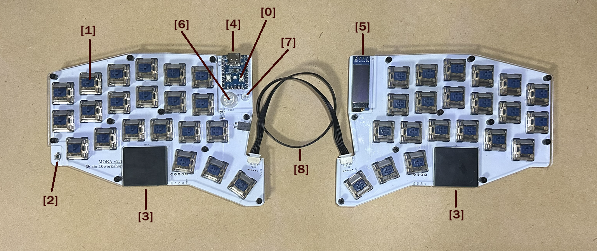
|番号|説明|
|:----|:----|
|1|磁気スイッチキー|
|2|タクトスイッチ|
|3|タッチパッド|
|4|メインマイコン|
|5|OLEDディスプレイ|
|6|人感センサー|
|7|光量センサー|
|8|左右通信ケーブル|

横
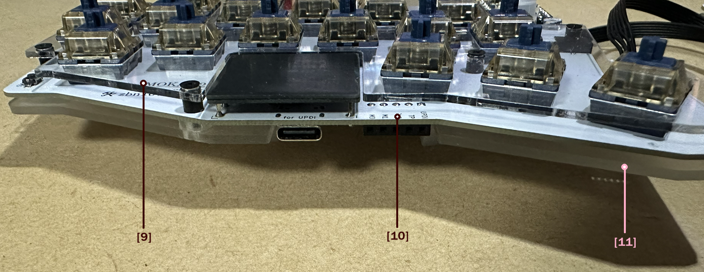
|番号|説明|
|:----|:----|
|9|スイッチプレート|
|10|キーボード基板|
|11|ボトムプレート|

裏
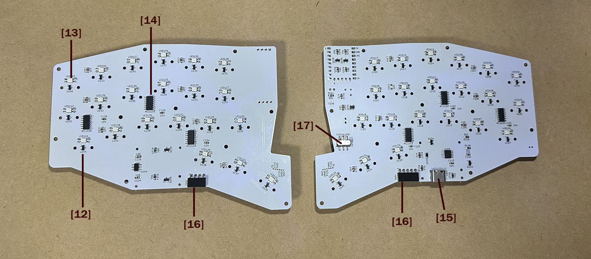
|番号|説明|
|:----|:----|
|12|磁気センサー|
|13|キーLED|
|14|サブマイコン|
|15|サブマイコンファームウェア書き込み(UPDI)用USBシリアル|
|16|UPDI接続ソケット|
|17|通常時/UPDI書き込み時 切り替えスイッチ|

## 2. 初期設定方法
### 2.1 物理的な組み立て・PC接続
1. [組み立て](#assembly) を参照し、プレートと基板を組み立てる。  
動作を試すだけなら、スペーサ設置・ネジ止めは不要で、ボトムプレート・基板・スイッチプレートを重ねて乗せるだけでもOK。ボトムプレートは固定されないので扱いには注意ください。　　　　　　　　
2. 左手側にあるマイコンの USB 端子と PC を USB ケーブルで接続する。
> [!WARNING]
> キーボードを PC に接続する際、あるいはリセットする際は、磁気スイッチを押さないでください。起動時に磁気スイッチのリリース位置を把握しているため、押したまま起動すると正しく状態を判定できなくなります。

### 2.2 磁気センサーキャリブレーション
キーボードを初めて使う場合や磁気スイッチを交換した場合は、キャリブレーションを行います。  
[キャリブレーション](#calibration) を参照し、実行してください。

### 2.3 動かしてみる
初めて動かしたときは、デフォルトキーマップとなっています。また接続している PC のキーボードレイアウトが英語/US を前提にしたマップになっていますが、通常のアルファベット入力は US/JP どちらでも同じなので入力は試せます。  
日本語/JP 用の設定についてはキーマップ編集で記述します。

デフォルトキー配置(レイヤ0)
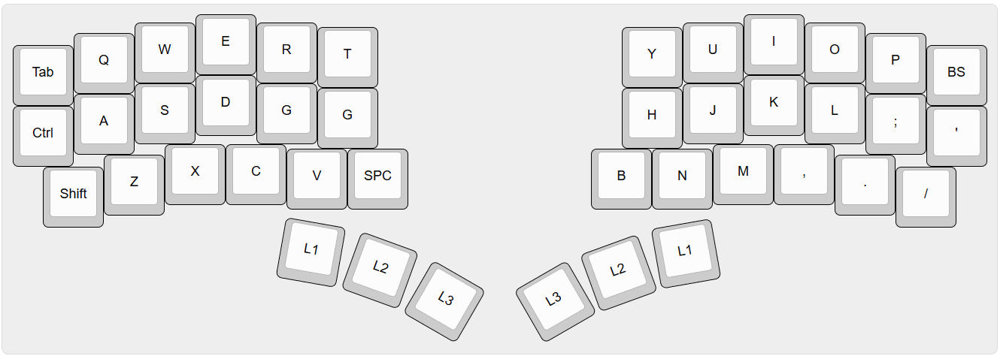
キーを押して PC に入力できるか確認してください。  
タッチパッドもマウスカーソルを動かしてみてください。

## 3. 機能説明

### 3.1 磁気スイッチ
本キーボードのメインである磁気スイッチキーの機能について記載します。

#### 3.1.1 キーの押下状態
キーの入力判定に使う磁気スイッチの状態には以下があります。
* 半押し（途中まで押した状態を一定時間キープ）
* 全押し
* タップ（全押し後、一定時間以内にリリース）
* 長押し1（全押し1秒継続）
* 長押し2（全押し3秒継続）

半押しとは、磁気スイッチを途中まで押して一定時間維持した状態で、全押しと別のキーアサインができます。
アナログ入力の磁気スイッチならではの機能として実装していますが、押すのが難しい。  
デフォルトキーマップでは、キー0, 12 の半押しにそれぞれ F2(windows でファイル名の変更), F7(カタカナ変換) キーを割り当てています。
小指を乗せるように押せば押せます。たまに押しすぎて全押しになります。

#### 3.1.2 アクチュエーションポイント・判定時間の設定
リリース状態（0）から押し込み状態（255）の範囲で、スイッチ毎の動作ポイントを設定します。  
タップ判定時間も設定します。

デフォルト値（アンダーライン値：設定でスイッチ毎に変更可能）
|状態|動作ポイント|リリースポイント|時間(ms)|
|:----|----:|----:|----:|
|半押し|<ins>60</ins>|<ins>30</ins>|50|
|全押し|<ins>150</ins>|<ins>50</ins>|-|
|タップ|-|-|<ins>900</ins>|
|長押し1|-|-|1000|
|長押し2|-|-|3000|

磁気センサーの値は、スイッチリリース状態近くでは押しても変化量が少なく、押し込み位置近くでは変化が大きくなります。
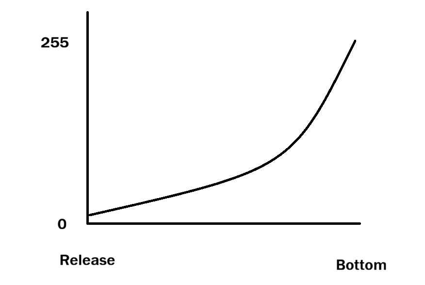

例えば 128 という中間数値を指定した場合、実際には半分よりもさらに押した位置になります。
ファームウェアで補正はしていないので、アクチュエーションポイントを設定する場合は、この特性を踏まえて設定します。

#### 3.2.3 磁気センサーキャリブレーション
磁気スイッチの位置を読み取るセンサーは、スイッチの磁力をアナログ値で読み取ってスイッチのリリース位置・押し込み位置を判断します。  
センサー値はスイッチの個体差などが出るため、キーボードの使い始め、磁気スイッチを交換したときに位置を学習するキャリブレーションを行います。

正確に言うと、押し込み位置をキャリブレーションで学習します。リリース位置はキーボードの起動時に毎回位置を読み取ります。

#### 3.1.3 キャリブレーション
**1. キャリブレーションモードに入る**

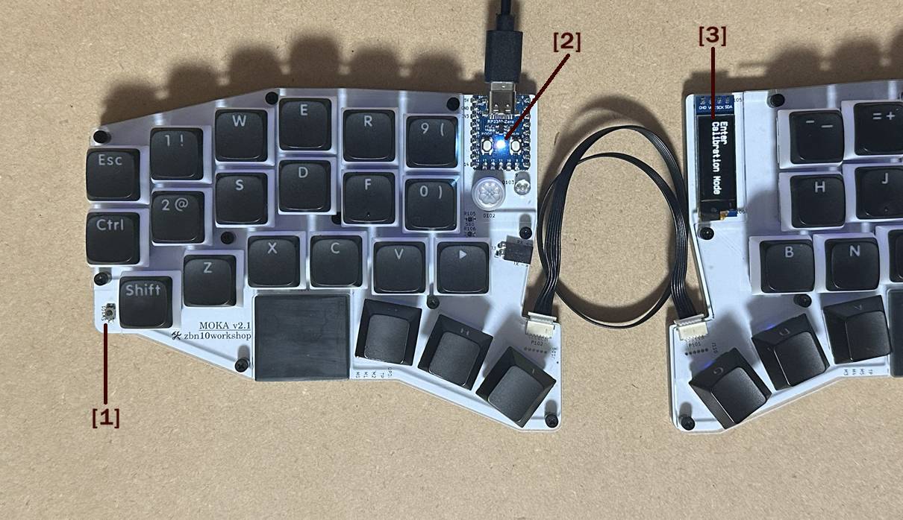

* タクトスイッチを [1]長押し(3秒) します。
* [2] LED が点滅を始めます。[3] OLEDディスプレイ に Enter Calibration Mode と表示されます。

これでキャリブレーションモードに入りました。

**2. キーを何度か押す**

各キーを 3,4回ずつ押します。  
初めて使う時、磁気スイッチを交換したときは全てのキーを、一部のキーのみキャリブレーションしなおす場合は該当キーだけ押します。

普段のキータイピングと同じ程度の強さ、速度で押してください。ゆっくりすぎたり早すぎるとセンサー読み取り誤差が大きくなります。

**3. キャリブレーションモードを終了する**

タクトスイッチをポチっと押して、キャリブレーションモードを抜けてください。LED 点滅が終了し、OLEDディスプレイに Exit Calibration Mode と表示されます。
> [!WARNING]
> キャリブレーションの結果はモード終了時に保存されるので、必ずキャリブレーションモード終了操作を行ってください。

### 3.2 タイピングにかかわるキーボード動作

キーボードとして使う上で、把握しておくべき基本的な動作を記載します。

#### 3.2.1 一旦押したら離すまでは同じ文字・機能
キー0 のレイヤ0 に a、レイヤ2 に @ がアサインされているとします。  
キー0 を押したままレイヤ2 選択キーを押してもキー0 は a のままです。一度はなしてもう一度押せばその時のレイヤのキーになります。
```mermaid
gantt
    dateFormat DD
    axisFormat %d
    tickInterval 1day
    section キー0状態
        全押し  :a1, 01, 2d
        リリース     :done, a2, after a1, 2d
        全押し  :a3, after a2, 2d
    section レイヤ2選択状態
        L2選択   :b1, 02, 4d
    section キー0入力
        a         :active, a1, 01, 2d
        @         :active, a3, after a2, 2d
```

Alt + Shift + Space のように複数同時押しが必要なショートカットなどで、それぞれ別レイヤにアサインされていても、順番に押していけば送信できます。ちょっとした慣れは必要です。

#### 3.2.2 レイヤ選択キーの同時押しは、数字の大きいレイヤが有効
レイヤ1キーをおしっぱなしで途中だけレイヤ2キーを押すと、レイヤ2を押している間だけレイヤ2が選択された状態になります。

```mermaid
gantt
    dateFormat DD
    axisFormat %d
    tickInterval 1day
    section レイヤ1キー
        L1         :active, a1, 01, 1d
        L1(負け)        :done, a2, after a1, 1d
        L1         :active, a3, after a2, 1d
    section レイヤ2キー
        L2(勝ち)         :active, b1, 02, 1d
```

#### 3.2.3 文字・機能アサインがないキー状態は無視
|全押し|タップ|長押し1|長押し2|
|:----:|:----:|:----:|:----:|
|a|(-)|(-)|(-)|

これは普段一番使うパターンで、全押し状態以外は無視され、全押し状態が継続します。
```mermaid
gantt
    dateFormat DD
    axisFormat %d
    tickInterval 1day
    section キー0状態
        全押し        :b1, 01, 1d
        タップ        :b2, after b1, 1d
        長押し1        :b3, after b2, 1d
        長押し2        :b4, after b3, 1d
    section キー0入力
        a         :active, a1, 01, 1d
        a         :active, a2, after a1, 1d
        a         :active, a3, after a2, 1d
        a         :active, a4, after a3, 1d
```

---
|全押し|タップ|長押し1|長押し2|
|:----:|:----:|:----:|:----:|
|Ctrl|(-)|a|b|

使うことはほぼ無いと思いますが、動作の特徴を使えばこうなりますという例です。  
押してから発動を遅延させたいケースに使えます。全押し状態には単独で押しても動作に影響がないキーを当てがっておけばいいのかと。

#### 3.2.4 タップ動作
一般のタップ動作は、キーを押してからタップ判定時間が経過する前にキーを離せばタップ入力、判定時間が過ぎれば通常入力という使い分けをすると思います。

MOKA のデフォルトではタップは以下の動作をします。  
例としてキーx に  
全押し：L1  
タップ：Enter  
がアサインされている時の動作です。

ケース1：キーx を押した後に他のキーは押さずにキーx をタップ判定時間経過**前**に離す  
一旦全押し入力が有効になり、タップ判定までにリリースするとタップ動作入力も行われます。  
通常入力とタップ入力を時間で区切って使い分ける、という普通のタップ動作ではありません。  
いきなり入力状態になっても困らないレイヤ選択キーに、タップで別の機能を組み合わせることを前提にした動きです。
```mermaid
%%{init: {'gantt': {'todayMarker': 'off'}}}%%
gantt
    dateFormat DD
    axisFormat %d
    tickInterval 1day
    section キーx判定時刻
        タップ判定(0～900ms) :done, a1, 01, 4d
        全押し判定(900ms～) :done, a2, after a1, 2d
    section キーx状態
        全押し        :b1, 01, 1d
        リリース       :milestone, b2, after b1, 0d
    section キーx入力
        L1            :active, c1, 01, 1d
        Enter         :active, c2, after b1, 1d
```

---
ケース2：キーx を押した後に他のキーは押さずにキーx をタップ判定時間経過**後**に離す  
これも普通のタップ動作とは違い、タップ判定時刻が来てから L1入力になるのではなく最初からずっと L1 です。
```mermaid
gantt
    dateFormat DD
    axisFormat %d
    tickInterval 1day
    section キーx判定時刻
        タップ判定(0～900ms) :done, a1, 01, 4d
        全押し判定(900ms～) :done, a2, after a1, 2d
    section キーx状態
        全押し        :b1, 01, 5d
        リリース       :milestone, b2, after b1, 0d
    section キーx入力
        L1         :active, c1, 01, 5d
```

---
ケース3：キーx を押した後にタップ判定時刻が来る**前**にxはそのままで**別のキーy を押してからキーxを離す**  
判定時間経過前にキーx を離しているのに、タップ入力をキャンセルします。  
キーx 以外のキーを押すということはキーx のタップ入力をしたいケースではない、という前提の動作です。
```mermaid
gantt
    dateFormat DD
    axisFormat %d
    tickInterval 1day
    section キーx判定時刻
        タップ判定(0～900ms) :done, a1, 01, 4d
        全押し判定(900ms～) :done, a2, after a1, 2d
    section キーx状態
        全押し        :b1, 01, 3d
        リリース       :milestone, b2, after b1, 0d
    section キーy状態
        全押し        :y1, 02, 1d
        リリース       :milestone, y2, after y1, 0d
    section キーx入力
        L1         :active, c2, 01, 3d
```

---
このタップ動作自体は、キーボード全体で普通のタップ動作に切り替えることもできます。  
ただ、普通のタップ動作だと判定時間が長くても短くても入力に不都合が起こりちょうどいい時間が決められず、結局通常入力とタップ入力の併用ができなかったので、この特殊な動作をデフォルトにしています。  
普通タップと特殊タップをキー毎に切り替えが出来るようにするとか、アサインされた機能がレイヤー選択かどうかで自動切換えすることも出来ますが、実装はニーズ次第かなと思っています。

#### 3.2.5 タッチパッドレイヤやマウスレイヤは無い
タッチパッド動作も、いずれかのレイヤの機能として動作しています。  
キーマップ上からは見えないですが、タッチパッドの通常動作(機能名:TOUCHPAD_L/R)は強制的にレイヤ0 に割り当てられています。レイヤ0 以外でタッチパッド標準動作を使う場合は各レイヤに機能アサインします。

タッチパッドはデフォルトキーマップでは以下のようになっています。
|レイヤ0|レイヤ1|
|:----:|:----:|
|通常動作 TOUCHPAD_L/R|倍速動作 TOUCHPAD_L2/R2|

### 3.3 キーマップ編集
* キーマップ編集
* キーマップ保存・読み込み

は、[キーマップ編集](キーマップ編集.md) を参照ください。
デフォルトキーマップを読み込んで、標準状態のキーマップを確認してみてください。

### 3.4 タッチパッド

タッチパッドは windows precision touchpad として動作します。
相互容量式センサーなので理論上はマルチタッチ検出可能なものの、今のところ左右各パッドに1タッチのみ、左右合計で同時2タッチのファームウェア実装です。マルチタッチよりも先に実装したい機能が多いためです。

> [!INFO]
> Mac で使う場合は、現状ではマウス互換モードで動作させることになります(モード切替機能があるのでキーマップでアサインします)。Macが認識する digitizer 動作も今後考えたいと思います。

#### 3.4.1 タッチパッド論理構成

OS からは横長の一つのタッチパッドとして認識されます。
左パッドが青、右パッドが赤の領域を担当します。
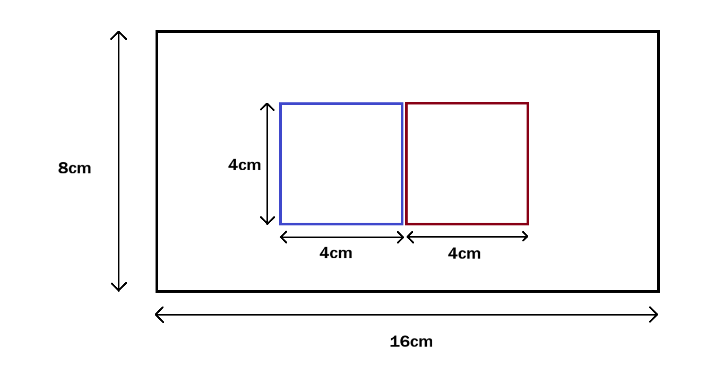

実際のパッドは 2cm x 2cm 程度なので倍の大きさとして OS に見せています。
物理サイズどおりだとパッドが小さく、カーソル移動可能な範囲が非常に狭くなってしまうためです。

一なぞりで一気に飛びたい時用に、さらに倍拡大のモードも用意しています。
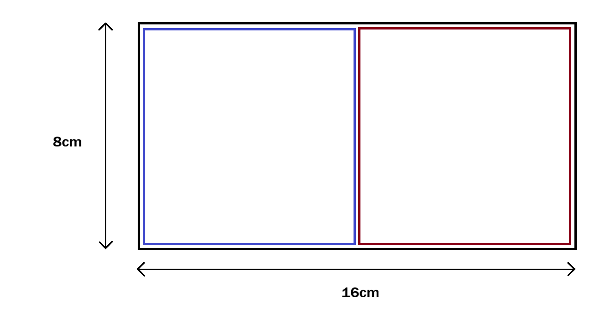

#### 3.4.2 マルチタッチ操作(2本指)

* **スクロール**

左右パッドを同時に上下・左右になぞれば 2本指スクロール動作です。単に左右のタッチをそのまま OS に通知しています。  
左右でなぞる速度が違ったり平行移動ができないと、単なるシングルタッチと解釈されたり、ピンチズームになってしまったりします。通常時2倍速動作にしてるのが OS側の誤判定につながっている気がしていて、もうちょっとファームウェアでのチューニング余地ありです。
シングルタッチでなぞれば 2本指として通知する機能を実装するでもいいんじゃね？と思っています。

* **ピンチズーム**

左右パッドをそれぞれ逆方法になぞればピンチズーム動作になります。

#### 3.4.3 円形ジェスチャースクロール

長いスクロールをマルチタッチでやるのもめんどくさいので、片方のパッドを円形ジェスチャーでなぞればスクロールになる機能を実装しています。
反時計回りでスクロールアップ、時計回りでスクロールダウンです。
OS にはマウスのホイール操作として通知しています。実装が圧倒的に楽だったので。

#### 3.4.4 物理ボタン

左ボタン、右ボタンがあります。磁気スイッチキーにアサインして使います。  
もちろん OS側が対応していればタッチパッドのシングルタップ、ダブルタップによるクリックも使えます。コツとしては気持ちゆっくりめにタップします。

#### 3.4.5 感度チューニング

大手メーカーの市販タッチパッドのような高精度を出すのは難しく、指をびたっと止めていてもタッチ検知位置としては小さな揺れが発生してしまいます。
ファームウェアで One Euro Filter と呼ばれるローパスフィルタを適用して、微小な動きを抑えています。

デフォルトでは保守的なパラメータで動かしていますので、指のスライド初期の追従性が低いです。もう少し機敏に動かしたい、あるいは左右の個体差を少なくする目的で、左右それぞれパラメータを変更できるようにしてあります。

### 3.5 キーボードの挙動切り替え・便利機能

* キーマクロ
* 同一キーマップのまま、PC側のキーボードレイアウト(EN/JP)に合わせたキーコードに切り替え
* タップ動作のジレンマ切り替え
* OLEDディスプレイを使った各種状態やイベント表示
* 一応マウスボタンも用意
* LEDパターン・明るさ設定。キーLEDの色・パターンは、半押し時・全押し時・リリース時ごとにビルトインパターンの中から選択。システムLEDは状態毎に色を指定。

### 3.6 周辺機能・メンテ機能

* ファームウェア書き換え。メインマイコンはRP2040系のストレージ書き込み。サブマイコンはキーボード内蔵のUSBシリアルUPDI経由で書き込み。
* シリアルコンソールでの各種操作、デバッグ。ファクトリーモード起動でUSBシリアルコンソール操作可能。
* 故障などで磁気スイッチがあばれるようなとき、エマージェンシーモード起動で磁気スイッチ無効な状態で、シリアルコンソール経由で対処。

## 4. 組み立て・分解

### 4.1 組み立て
スイッチプレート、基板、ボトムプレートをスペーサ・ネジで固定する構造になっています。  
コツ・注意点を中心に説明します。  
[組み立て](組み立て.md) 

### 4.2 分解
同じく [組み立て](組み立て.md) を参照ください。

## 5. 既知の問題
|問題|概要|ステータス|
|:----|:----|:----|
|操作が早すぎてたまにフリーズ|TinyUSBスタックに起因するレースコンディション問題。 HIDレポート頻度を落とすことでかなり緩和。 それでも運が悪いとたまにフリーズする。|完全には未解決だが ワークアラウンド適用済み|
|タッチパッド表面が雑|サンドペーパースキルがまだ低いので受け入れてください|徐々に改善予定|

## Appendix
### A. 入力一覧
タイピングやキーボード動作を行うための入力一覧。

|種類|番号|概要|
|:---|:---|:---|
|磁気スイッチ|0 ~ 41|本キーボードのメイン入力|
|タクトスイッチ|42|補助的に利用|
|タッチパッド左|44|一つの横長仮想タッチパッドの左側半分として動作|
|タッチパッド右|45|一つの横長仮想タッチパッドの右側半分として動作|
|人感センサー|46|いまのところマップ出来る機能はマウスジグラーのみ|
|光量センサー|47|いまのところマップ出来る機能は LEDの明るさ自動調整のみ|

### B. 動作一覧
入力に連動させる動作一覧。  
キーマップとして、入力と動作の組み合わせを定義して使う。  

[動作一覧](functions.md)

### C. デフォルト LED カラー
ファームウェアバージョン 1.0.0 でのデフォルト LED カラー

キーLED
|種類|色|
|:----|:----|
|半押し|黄|
|全押し|青|
|リリース|レインボー|
|エラー|赤|

システムLED（メインマイコンのLED）
|種類|色|
|:----|:----|
|キャリブレーション|白|
|システムイベント|青|
|サブマイコンエラー|赤|
|キーエラー|黄|
|NumLock|水色|
|CapsLock|緑|
|ScrollLock|紫|

### D. 困ったとき
[逆引き表](困った時.md)

### E. 使用パーツ一覧
[パーツ一覧](parts.md)
