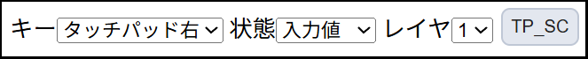

### 3.2 タイピングにかかわるキーボード動作

* [3.2.1 一旦押したら離すまでは同じ文字・機能](#function_fixing)
* [3.2.2 レイヤ選択キーの同時押しは、数字の大きいレイヤが有効](#layerconflict)
* [3.2.3 文字・機能アサインがないキー状態は無視](#noassignkey)
* [3.2.4 タップ動作](#tap)
* [3.2.5 タッチパッド動作のレイヤ配置](#touchpadonlayers)
* [3.2.6 レイヤホールド](#layerhold)
* [3.2.7 タッチパッドの円形ジェスチャースクロール](#circulargesturescroll)

---

#### 3.2.1 一旦押したら離すまでは同じ文字・機能
キー0 のレイヤ0 に a、レイヤ2 に @ がアサインされているとします。  
キー0 を押したままレイヤ2 選択キーを押してもキー0 は a のままです。一度はなしてもう一度押せばその時のレイヤのキーになります。

```mermaid
gantt
    dateFormat DD
    axisFormat %d
    tickInterval 1day
    section キー0状態
        全押し  :a1, 01, 2d
        リリース     :done, a2, after a1, 2d
        全押し  :a3, after a2, 2d
    section レイヤ2選択状態
        L2選択   :b1, 02, 4d
    section キー0入力
        a         :active, a1, 01, 2d
        @         :active, a3, after a2, 2d
```

Alt + Shift + Space のように複数同時押しが必要なショートカットなどで、それぞれ別レイヤにアサインされていても、順番に押していけば送信できます。ちょっとした慣れは必要です。

---

#### 3.2.2 レイヤ選択キーの同時押しは、数字の大きいレイヤが有効
レイヤ1キーをおしっぱなしで途中だけレイヤ2キーを押すと、レイヤ2を押している間だけレイヤ2が選択された状態になります。

```mermaid
gantt
    dateFormat DD
    axisFormat %d
    tickInterval 1day
    section レイヤ1キー
        L1         :active, a1, 01, 1d
        L1(負け)        :done, a2, after a1, 1d
        L1         :active, a3, after a2, 1d
    section レイヤ2キー
        L2(勝ち)         :active, b1, 02, 1d
```

---

#### 3.2.3 文字・機能アサインがないキー状態は無視
|全押し|タップ|長押し1|長押し2|
|:----:|:----:|:----:|:----:|
|a|(-)|(-)|(-)|

これは普段一番使うパターンで、全押し状態以外は無視され、全押し状態が継続します。

```mermaid
gantt
    dateFormat DD
    axisFormat %d
    tickInterval 1day
    section キー0状態
        全押し        :b1, 01, 1d
        タップ        :b2, after b1, 1d
        長押し1        :b3, after b2, 1d
        長押し2        :b4, after b3, 1d
    section キー0入力
        a         :active, a1, 01, 1d
        a         :active, a2, after a1, 1d
        a         :active, a3, after a2, 1d
        a         :active, a4, after a3, 1d
```

---
|全押し|タップ|長押し1|長押し2|
|:----:|:----:|:----:|:----:|
|Ctrl|(-)|a|b|

使うことはほぼ無いと思いますが、動作の特徴を使えばこうなりますという例です。  
押してから発動を遅延させたいケースに使えます。全押し状態には単独で押しても動作に影響がないキーを当てがっておけばいいのかと。

---

#### 3.2.4 タップ動作
一般のタップ動作は、キーを押してからタップ判定時間が経過する前にキーを離せばタップ入力、判定時間が過ぎれば通常入力という使い分けをすると思います。

MOKA のデフォルトではタップは以下の動作をします。  
例としてキーx に  
全押し：L1  
タップ：Enter  
がアサインされている時の動作です。

ケース1：キーx を押した後に他のキーは押さずにキーx をタップ判定時間経過**前**に離す  
一旦全押し入力が有効になり、タップ判定までにリリースするとタップ動作入力も行われます。  
通常入力とタップ入力を時間で区切って使い分ける、という普通のタップ動作ではありません。  
いきなり入力状態になっても困らないレイヤ選択キーに、タップで別の機能を組み合わせることを前提にした動きです。

```mermaid
%%{init: {'gantt': {'todayMarker': 'off'}}}%%
gantt
    dateFormat DD
    axisFormat %d
    tickInterval 1day
    section キーx判定時刻
        タップ判定(0～900ms) :done, a1, 01, 4d
        全押し判定(900ms～) :done, a2, after a1, 2d
    section キーx状態
        全押し        :b1, 01, 1d
        リリース       :milestone, b2, after b1, 0d
    section キーx入力
        L1            :active, c1, 01, 1d
        Enter         :active, c2, after b1, 1d
```

---
ケース2：キーx を押した後に他のキーは押さずにキーx をタップ判定時間経過**後**に離す  
これも普通のタップ動作とは違い、タップ判定時刻が来てから L1入力になるのではなく最初からずっと L1 です。

```mermaid
gantt
    dateFormat DD
    axisFormat %d
    tickInterval 1day
    section キーx判定時刻
        タップ判定(0～900ms) :done, a1, 01, 4d
        全押し判定(900ms～) :done, a2, after a1, 2d
    section キーx状態
        全押し        :b1, 01, 5d
        リリース       :milestone, b2, after b1, 0d
    section キーx入力
        L1         :active, c1, 01, 5d
```

---
ケース3：キーx を押した後にタップ判定時刻が来る**前**にxはそのままで**別のキーy を押してからキーxを離す**  
判定時間経過前にキーx を離しているのに、タップ入力をキャンセルします。  
キーx 以外のキーを押すということはキーx のタップ入力をしたいケースではない、という前提の動作です。

```mermaid
gantt
    dateFormat DD
    axisFormat %d
    tickInterval 1day
    section キーx判定時刻
        タップ判定(0～900ms) :done, a1, 01, 4d
        全押し判定(900ms～) :done, a2, after a1, 2d
    section キーx状態
        全押し        :b1, 01, 3d
        リリース       :milestone, b2, after b1, 0d
    section キーy状態
        全押し        :y1, 02, 1d
        リリース       :milestone, y2, after y1, 0d
    section キーx入力
        L1         :active, c2, 01, 3d
```

---
このタップ動作自体は、キーボード全体で普通のタップ動作に切り替えることもできます。  
ただ、普通のタップ動作だと判定時間が長くても短くても入力に不都合が起こりちょうどいい時間が決められず、結局通常入力とタップ入力の併用ができなかったので、この特殊な動作をデフォルトにしています。  
普通タップと特殊タップをキー毎に切り替えが出来るようにするとか、アサインされた機能がレイヤー選択かどうかで自動切換えすることも出来ますが、実装はニーズ次第かなと思っています。

---

#### 3.2.5 タッチパッド動作のレイヤ配置
タッチパッド動作も、いずれかのレイヤの機能として動作しています。  
キーマップ上からは見えないですが、タッチパッドの通常動作(機能名:TOUCHPAD_L/R)は強制的にレイヤ0 に割り当てられています。レイヤ0 以外でタッチパッド標準動作を使う場合は各レイヤに機能アサインします。

タッチパッドはデフォルトキーマップでは以下のようになっています。
|レイヤ0|レイヤ1|
|:----:|:----:|
|通常動作 TOUCHPAD_L/R|倍速動作 TOUCHPAD_L2/R2|

---

#### 3.2.6 レイヤホールド
CapsLock で大文字固定と似たような機能で、レイヤキーを押しっぱなしにしなくてもレイヤを固定する機能です。  
キーマップエディタ上の LHold です。

万人向けの機能ではないですが、以下のような用途には応用次第で便利かもしれません。
* フルキーボードのテンキーのように、数字と +-*/= を集めたレイヤで計算する時、そのレイヤに固定して打つ
* CapsLockで大文字をうつように、大文字用レイヤを用意して、そのレイヤに固定して打つ

使い方は、
1. レイヤ選択には使わないキーに LHold 機能を割り当てます。また固定したいレイヤ上で割り当てます。
   デフォルトキーマップでは、左手親指一番外側キー(キー38)のレイヤ1,2,3に割り当ててあります。
2. レイヤ1,2,3 を選択した状態で、LHold キーを押します。
   これで選択したレイヤに固定されます。
   この状態でレイヤ選択キーを押しても無効で、固定されたレイヤが勝ちます。
3. 解除するときは、もう一度 LHold キーを押します。

デフォルトキーマップでいうと、例えば L2(キー40)を押してから LHold(キー39)を押すと、レイヤ2 に固定されます。  
もう一度 LHold(キー39)キーを押せば、固定解除します。

---

#### 3.2.7 円形ジェスチャースクロール
タッチパッドを円形になぞることでスクロールする機能です。  
2本指でタッチパッドをなぞるより、圧倒的に楽にスクロールできます。今のところ縦スクロール専用です。

使い方は、
1. キーマップエディタの個別キーマップ設定で、タッチパッド右あるいは左に TP_SC(TouchPad Scroll)を割り当てます。
   現状(ファームウェアv1.0.0)では、レイヤ0 では割り当てができません。
   
2. 割り当てたレイヤ選択キーを押して、タッチパッドを円形になぞります。
   時計回りでスクロールダウン、反時計回りでスクロールアップです。

タッチパッドの真ん中が円の中心なので、指を中心近くで動かすと回転方向を逆に判定してしまうことがあります。大きめの円を描くと安定します。
