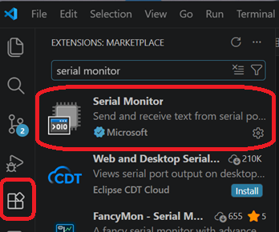
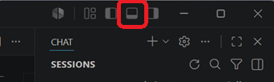
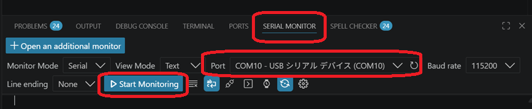
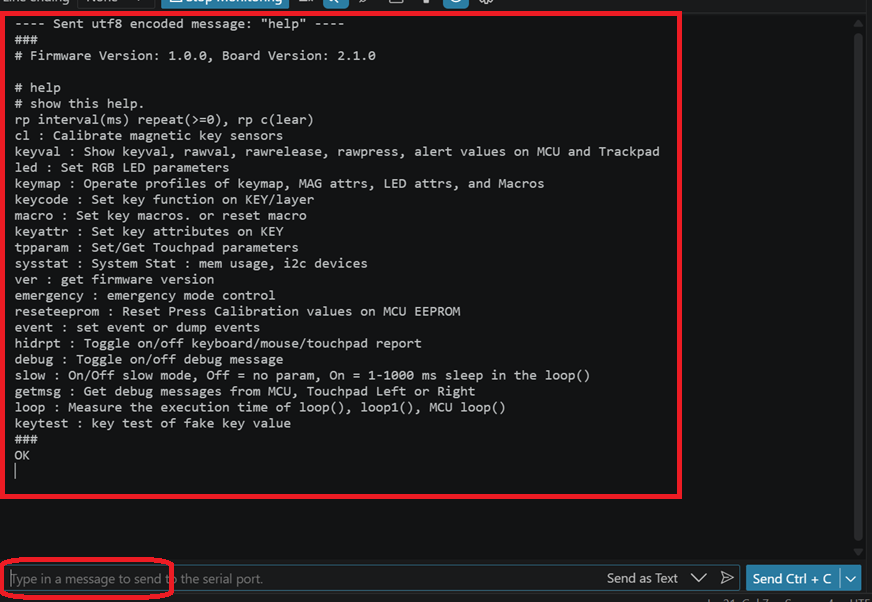

# VS CODE Serial Monitor

## 1. Serial Monitor エクステンションのインストール
Microsoft 謹製の Serial Monitor エクステンションをインストール

---
## 2. VS CODE のパネル表示
VS CODE 右上にあるペイン選択ボタンの中からパネルを表示

---
## 3. パネルメニューの Serial Monitor で MOKA の USBシリアルコンソールに接続
1. パネルメニューから Serial Monitor を選択
2. MOKA をファクトリーモードで起動すると USBシリアルポートが出てくるので、それを選択
3. Start Monitoring で USBシリアルポートに接続

---
## 4. 接続確認
Serial Monitor 画面の下段、メッセージテキスト欄で
help <kbd>&#x23ce;</kbd>
を入力して、help 一覧が出てくれば OK

