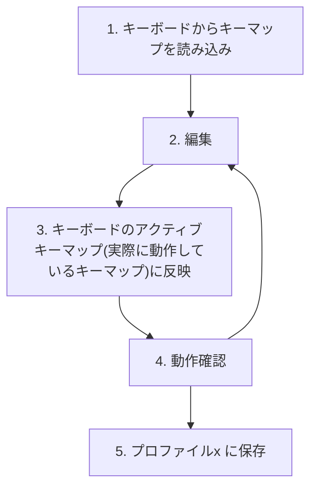
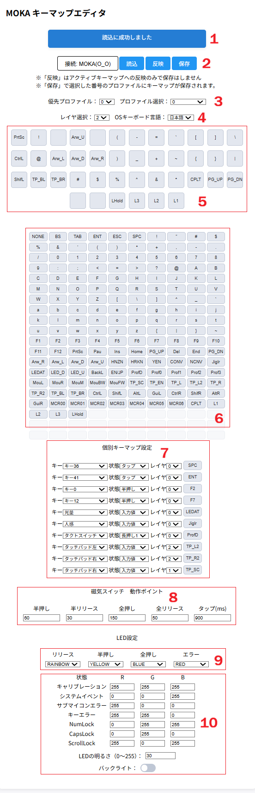
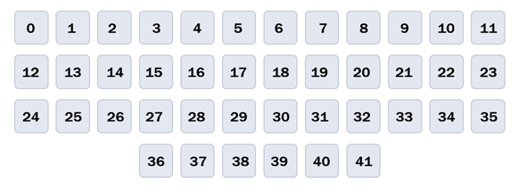

# キーマップ編集

## 1. 概要
40% 以下のキーボードはキーがかなり少ないので、キーの配置位置・複数のレイヤの使い分けを自分好みにカスタマイズするのが醍醐味の一つです。  
ここではキーマップ編集を試行錯誤するためのエディタ操作について記載します。使いやすいキーマップのノウハウや配置の工夫はここでは書きません。

* 最初はメインのキーマップと、最小限の個別キーマップをいじれば大丈夫です。ほかの項目はデフォルトのままでかまいません。
* タップ動作への配置は個別キーマップで行います。
* タッチパッドの感度調整項目が今は無いですが、とっとと入れようと思います。
* マクロ設定は、、画面がうるさくなりそうなので実装方法を考えたいと思います。

### 1.1 プロファイル
|設定項目|保存|
|:----|:----|
|キーマップ・磁気スイッチ動作ポイント|4プロファイル|
|LED設定・マクロ等|全プロファイル共通|

* 4つの独立したキーマップ（以降プロファイルと呼びます）を保存できます。
* とりあえずテンプレートに使えるデフォルトキーマップもあります。開発者の好みが反映されています。
* 各キーマップでは、42個のキー × 4レイヤ分のキーアサインと、それでは足りないキーアサインを個別設定します。

### 1.2 デフォルトキーマップ
デフォルトキーマップの構成は以下のようになっています。
* 全般：他のキーと組み合わせて使うことが多い Ctrl, Shift や、レイヤ選択キーなどはおおよそ全レイヤの同じ位置に配置
* 全般：フルキーボードのキー配置に近い場所にキーアサイン（もちろんかけ離れるキーもあり）
* レイヤ0：a～z の小文字アルファベットと、多少の記号類
* レイヤ1：A～Z の大文字アルファベットと、レイヤ0の記号の Shift時記号
* レイヤ2：矢印キー、マウスボタン、タッチパッド物理ボタン、多くの記号類など
* レイヤ3：数字・四則演算に使う記号類、キーマップ読み込みなどキーボード動作に関する機能、レイヤ2で配置しきれなかった機能を配置
* 個別設定：タッチパッド設定、タップ動作への一部キーアサインなど

デフォルトキーマップのレイヤ1 って何？と思うかもしれません。レイヤ0 で Shift 押しながらアルファベット押すのと同じでは？  
アルファベットだとその通りですが、例えば :（コロン）を押すのに日本語キーボードOSだと : 、英語キーボードOSだと Shift + ; ですよね。OSの設定にかかわらず「: を押す」というキーマップにするためにこうしています。Shiftキーの代わりにレイヤ1キーを押すようなイメージです。

キーマップ編集はシリアルコンソールのほうが細かい設定が出来ますが、ほとんどの場合はブラウザで十分だと思います。

## 2. キーマップエディタ
ここではブラウザで使えるキーマップエディタについて記載します。  
ブラウザは原則 chrome を使ってください。

キーマップエディタでのキーマップ編集の流れは大雑把に以下のようになります。

---
エディタの簡単なセクション説明です。
1. メッセージ表示
2. キーボードとのインタラクション
3. 起動時に適用するプロファイル(優先プロファイル)選択、キーボードからエディタに読み込むプロファイル選択
4. 現在表示しているレイヤと、英語配列・日本語配列の選択
5. キー配列と、各キーにアサインされた文字・機能
6. 文字・機能[一覧](functions.md)
7. レイヤ0～3のマップには配置しない個別のキーマップ設定
8. 磁気スイッチの動作ポイント
9. キーLED の色選択
10. システムLED の色選択

キー番号は左上から右下に順番に並んでいます。

### 2.1 準備
1. https://github.com/zbn10/MOKA-keymapeditor で公開している内容を、ローカルのPCに持ってきます。
   * 上記ページの Code ボタンから Download ZIP でダウンロードして、展開するか、
   * git clone してください
2. 持ってきたファイルの中にある index.html をブラウザで開いてキーマップエディタアプリを立ち上げる
3. MOKA を PC に接続する

### 2.2 キーマップエディタから MOKA に接続する
1. 画面上部の '未接続' ボタンを押す
2. ポップアップ画面が出てくるので、MOKA(O_O) を選択して「接続」する
3. 正しく接続できたら、'未接続' ボタンが '接続: MOKA(O_O)' に変化

### 2.3 編集する
上で書いたキーマップ編集の流れに沿って記載します。

#### 2.3.1 キーボードからキーマップを読み込み
1. 'プロファイル選択' で、読み込みたいプロファイルを選択します
   1. アクティブ：今キーボードで動いているプロファイル
   2. 数字0～3：キーボードに保存されているプロファイル
   3. デフォルト：ファームウェアが持っているデフォルトプロファイル
2. '読込' クリック
   * プロファイル0～3 を選んだものの、その番号に保存がなければエラーメッセージが出ます。
3. 画面上の各所に読み込んだ内容が反映されます

#### 2.3.2 編集
* 各レイヤのキーマップ編集
  * 編集したいレイヤを選んで、文字・機能一覧からドラッグ＆ドロップで配置したいキー位置に文字・機能を置きます。
  * 文字・機能一覧の説明は [こちら](functions.md)。
  * キーアサインを消したい場合は、NONE を配置してください。
  * 同じ文字・機能を複数個所に配置できます。
* 個別キーマップ編集
  * 同じように文字・機能をドラッグ&ドロップで置きます。
  * アサインするキー、発動するキー状態、発動するレイヤを選択します。
  * LEDAT, JIGLR は特殊で、個別キーマップ設定で 状態'入力値'を選んで使います。
* OSキーボード言語 を選択
  * キーボードを接続している PCのキーボード設定が日本語か英語かを選びます。
  * MOKA がこの設定に合わせたコードを送信するので、接続先OSが日本語でも英語でも同じキーマップが使いまわせます。

#### 2.3.3 キーボードのアクティブキーマップ(実際に動作しているキーマップ)に反映
'反映' ボタンでキーマップをキーボードに反映します。  
即時反映です。

#### 2.3.4 動作確認
実際にキーボードを動かしてみて、思った通りか確認してください。

#### 2.3.5 プロファイルに保存
これでOKになったら、キーボード上でアクティブに動いている内容を保存します。
1. 優先プロファイルとプロファイル選択
   * 優先プロファイル(キーボード起動時に読み込むプロファイル)が合っているか確認してください。
   * プロファイル選択で、今回保存するプロファイル番号を設定してください。
2. '保存' ボタンで保存してください。
