## 4. 組み立て・分解

### 4.1 組み立て

#### 4.1.1 スイッチプレートへの磁気スイッチ搭載
磁気スイッチをスイッチプレートに設置するのは、キーボード本体をくみ上げる前でも後でも可能です。  
ただ、先にプレートにのせたほうが後続のネジ止めの際に作業が楽になります。
スイッチのマウントピンが基板にささるので、プレートが基板からずれなくなります。

> [!WARNING]
> スイッチプレートはアクリルなので多少まがりますが、強く曲げると割れます。
> スイッチを押し込む際は、そのスイッチ周辺のプレートを裏側から指でささえてください。

> [!WARNING]
> スイッチの向きに気を付けてください。
> キーボードを使う人から見て、キーLED がキースイッチの奥にあるので、キースイッチのLED窓が奥にくる向きで設置してください。

裏から 4本指で支えると搭載しやすいと思います。※指は私ではありません。  
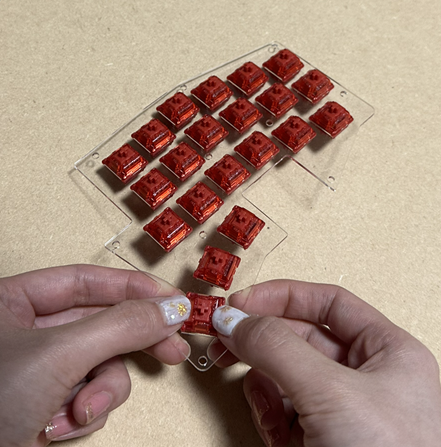

LED窓がキーボードの奥側になるように
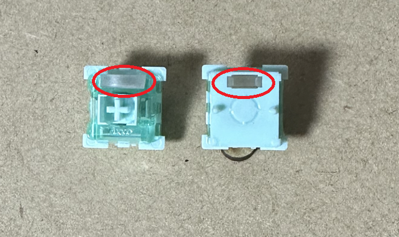

#### 4.1.2 基板にスペーサをのせて、その上にスイッチプレートをのせる
> [!WARNING]
> スペーサは転がるので、机から落ちて見つからなくなる事故が起こりやすいです。ご注意ください。

> [!TIP]
> スペーサは小さいので、指よりもピンセットで穴をつまんで乗せるほうが作業が楽です。

ネジを通す穴(M2)が片側に 10個開いているので、その上にスペーサをのせます。  
キースイッチのマウントピンがささる穴より、少し大きな穴です。  
多少穴からずれてもネジが通るズレなら大丈夫です。完全に穴から外れている場合は穴に寄せてください。
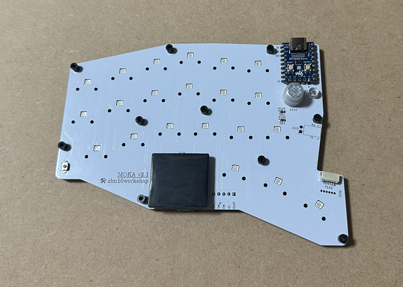

---
基板とスペーサの上にスイッチプレートをのせます。  
真上からそっとおいてください。

> [!TIP]
> この時に、スイッチプレートにスイッチがのっていれば、マウントピンが基板にささるので確実に位置が合います。

> [!TIP]
> スイッチのマウントピンが最後まで基板にささりきっている必要はありません。軽くのっているだけで大丈夫です。
> スペーサが完全にずれてしまったときにスペーサ位置を修正するためにプレートをはずしやすくなります。

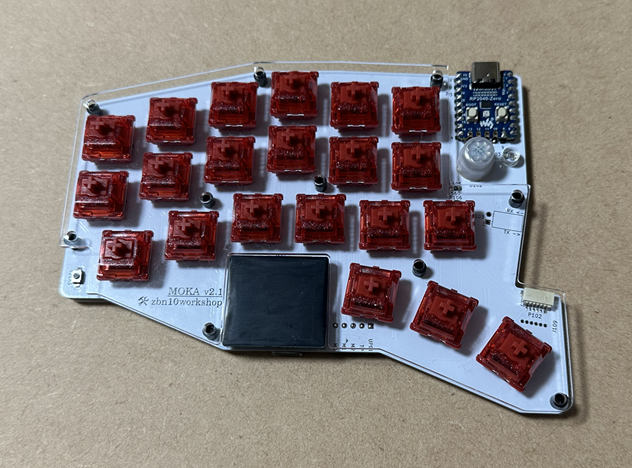

---
以下程度のズレはピンセットか爪楊枝などで真ん中に修正します。

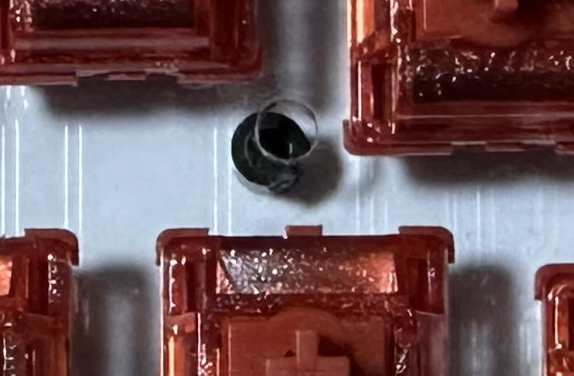
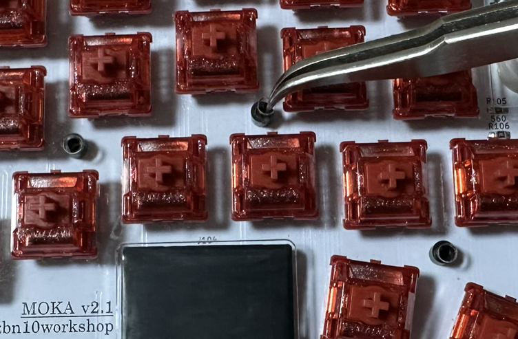

#### 4.1.3 ネジを通す
10個の穴にネジを指します。スペーサも通っていることを確認してください。  
> [!TIP]
> 指での作業でもいいですが、もしキーキャップも付いている状態だと真ん中付近のネジが通しにくいので、
> ピンセットでやったほうが作業が楽です。

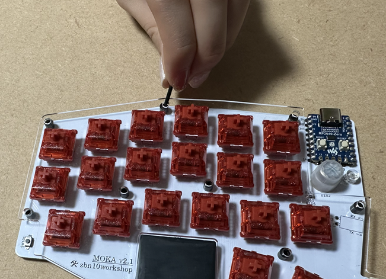
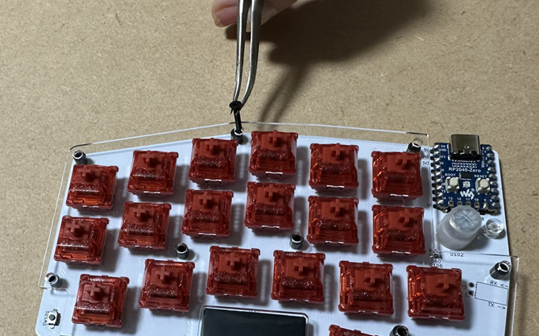

#### 4.1.3 ボトムプレートの上に基板をのせる
基板をボトムプレートの上にのせます。  
ボトムプレートの表裏は、ナット穴をふさぐ出っ張りがあるほうが表(上側)です。  
真上からずれないようにそっとのせます。
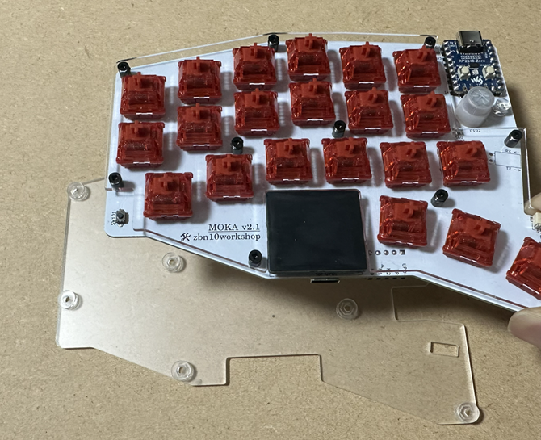

---
この時、以下の写真のようにネジがボトムプレートの穴にささらず浮き上がることがあります。  
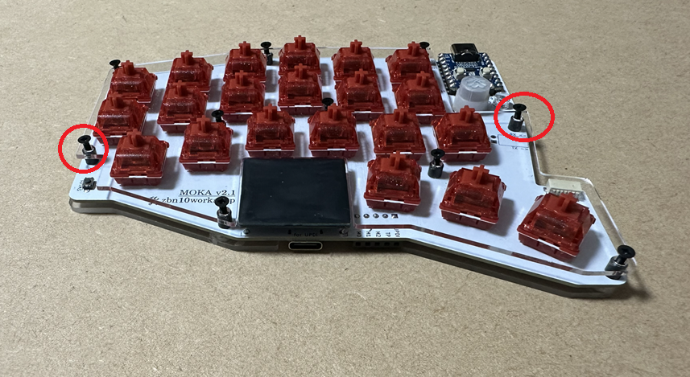
基板をほんの少し前後左右に動かしながら、ネジを穴に落とします。
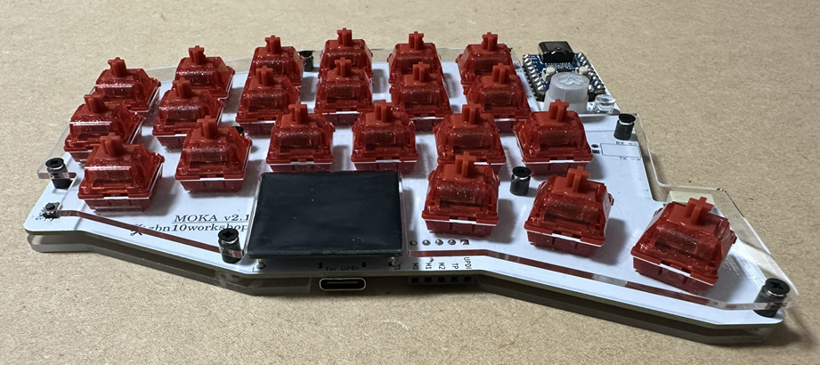

#### 4.1.4 ネジ締め
ボトムプレートの裏には、六角ナットがはまる穴があいています。
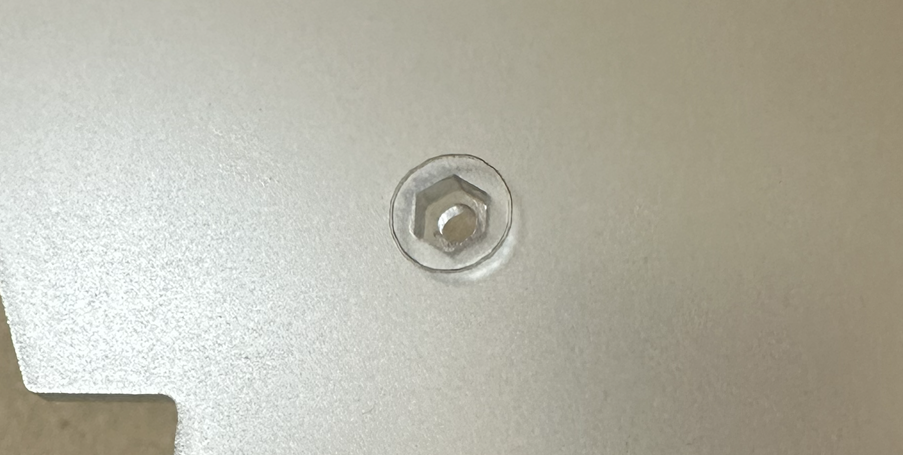

---
指に六角ボルトをのせ、ボトムプレートの下からネジを締めたい場所に入れます。  
ナットの角度が穴に合っていない時は、ナットをのせている指先をグリグリ回転すると、どこかでスポっとはまります。
> [!TIP]
> 指からナットが転がり落ちる事故も起こりやすいので、机の上にタオルなどを敷いて作業すると行方不明になりにくいです。

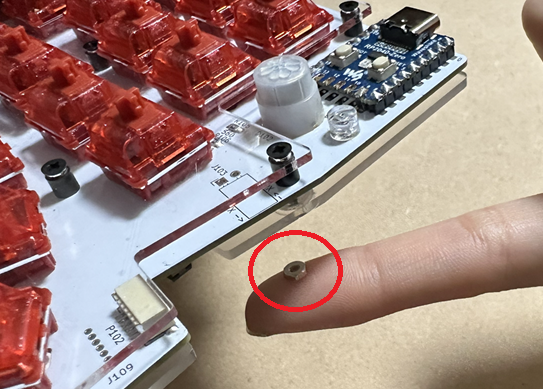

---
指で裏からナットを押した状態で、表からネジを締めます。  
> [!WARNING]
> 樹脂製のネジは柔らかいため、サイズの合っていないドライバーで締めるとすぐにナメます。
> 十字穴に合うドライバーを使用ください。

> [!WARNING]
> また、締めすぎにも十分注意ください。
> ネジが締まって少しドライバーに抵抗感が出たら、そこから 8分の1回転ほど締めれば十分です。

> [!TIP]
> ドライバーをまわし続けても一向に締まらない場合は、ナットがネジにひっかかっていません。
> 指をぎゅっとおさえてナットを上に持ち上げればネジにひっかかりやすくなります。

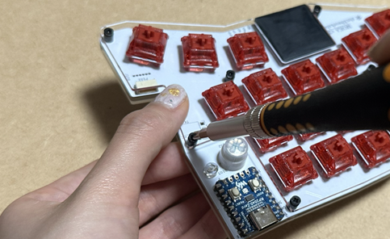

#### 4.2 左右接続ケーブルの接続・取り外し
#### 4.2.1 接続
基板側はハウジング内にピンがあります。このピンはハウジング内の上側についています。
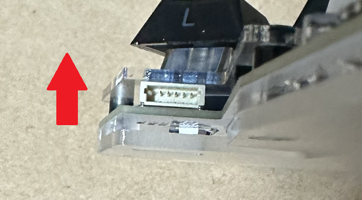

---
ケーブル側はこのピンがささる穴が開いているので、穴が上になるようにハウジングに接続します。
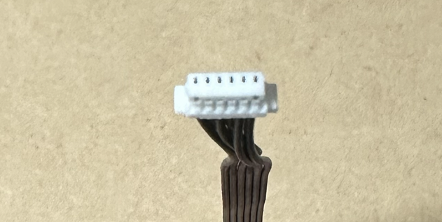
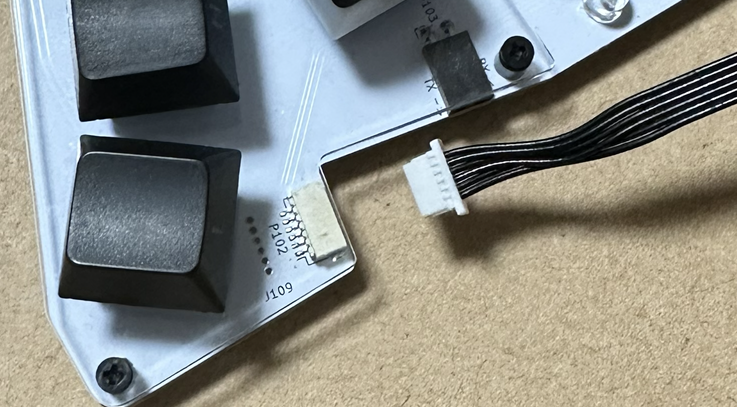

---
コンタクトをハウジングに押し込む際は、コンタクト側の両端の出っ張りを爪などで同時に押してください。  
写真の位置まで刺さればOKです。
> [!WARNING]
> 押し込み時に入りにくさを感じたら、無理に押し込まずにまずはケーブルの上下が合っているか確認してください。

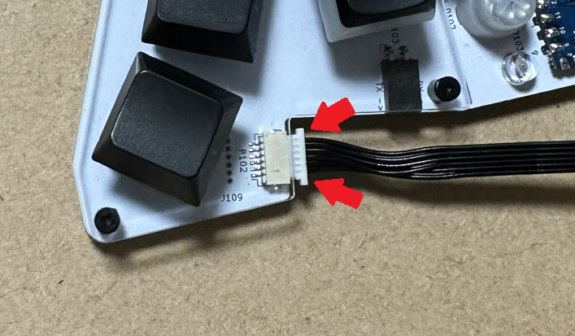

---
ケーブルを抜くときは、コンタクト根っこ近くのケーブルを持って抜きます。  
硬い場合は、コンタクトを少しずつ左右に揺らしながら徐々に抜いてください。力任せにひっぱらなくても抜けます。
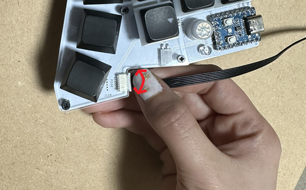

### 4.3 分解
分解は手順がなくとも出来るのですが、コツ・注意点だけ記載します。
* ネジを緩めた後、思わずキーボードを裏返してネジが落ちてどっかいかないように気を付けてください。
* キースイッチプレートを持ち上げて外した時に、スペーサがスイッチプレートにくっついて一緒に持ち上がることがあります。で、途中で落ちてどっかいきます。スイッチプレートはいったん基板の横に置くのが無難です。
* スイッチプレートからキースイッチを取り外す際は、スイッチプラーを使ってください。無理にひきはがすとプレートが割れます。
